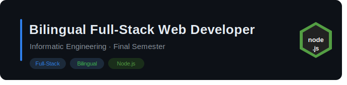

  

  

  <h1>My strength is:</h1>

|     `Node.js`      |       |      `Express`      |       |      `React`      |       |      `SQL`      |       |      `Git`      |       |     `MongoDB`      |       |
| :----------------: | :---------------------------------------------------: |:----------------: | :---------------------------------------------------: | :----------------: | :---------------------------------------------------: | :----------------: | :---------------------------------------------------: | :----------------: | :---------------------------------------------------: |:----------------: | :---------------------------------------------------: |

<!--
**Jazi87r/Jazi87r** is a ✨ _special_ ✨ repository because its `README.md` (this file) appears on your GitHub profile.

Here are some ideas to get you started:

- 🔭 I’m currently working on ...
- 🌱 I’m currently learning ...
- 👯 I’m looking to collaborate on ...
- 🤔 I’m looking for help with ...
- 💬 Ask me about ...
- 📫 How to reach me: ...
- 😄 Pronouns: ...
- ⚡ Fun fact: ...
-->
